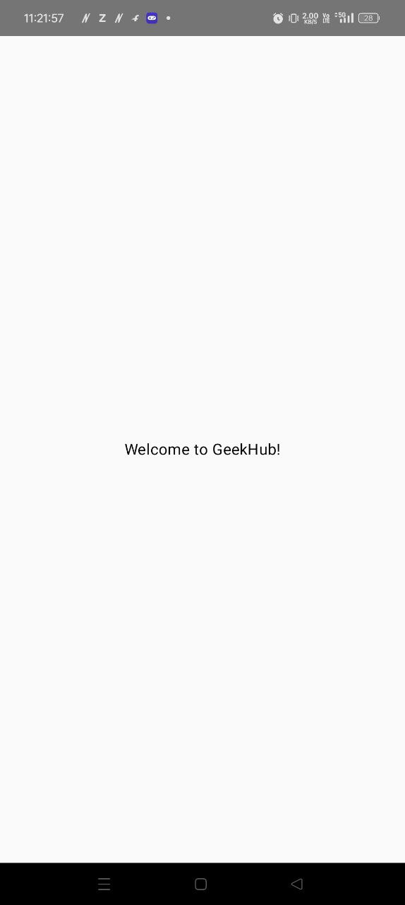
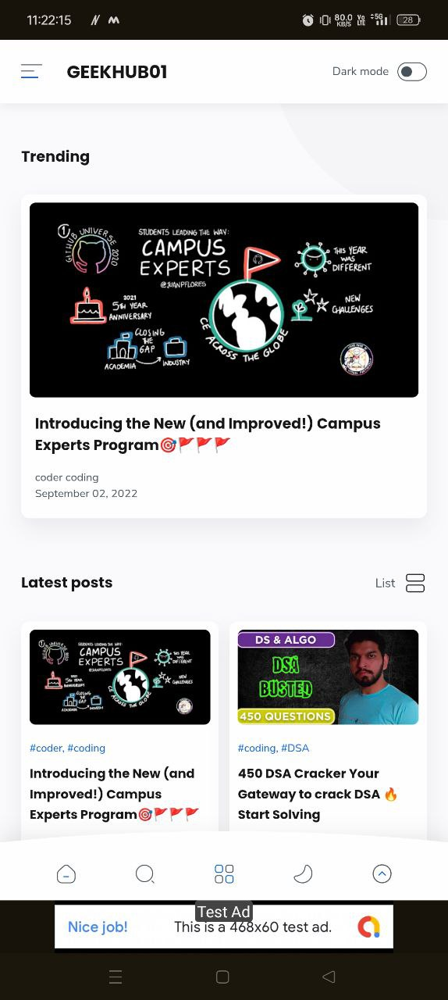
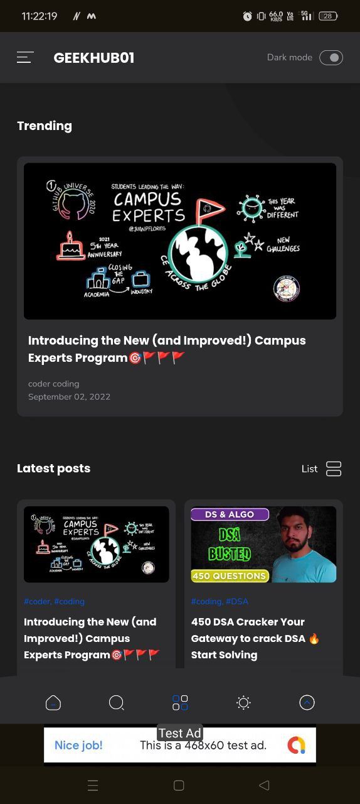
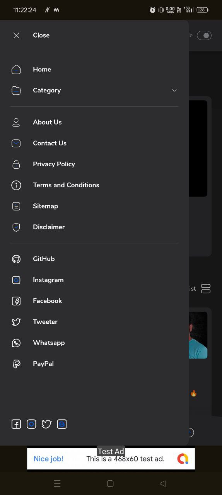
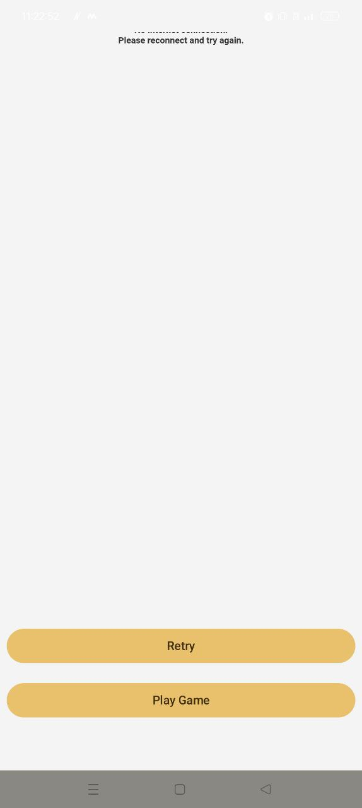
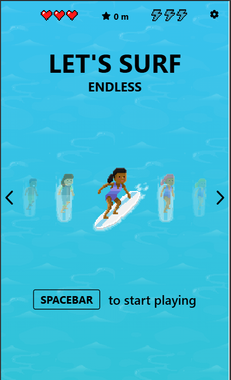
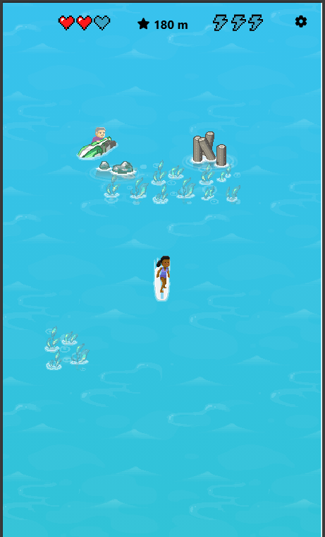

---

# GeekHub - Security Blog App

# 🛡️ Security Blog Platform

A web and mobile application designed to share and explore information about cybersecurity, vulnerabilities, and secure coding practices. This platform provides an engaging way for security enthusiasts to stay updated with the latest trends and techniques in the field of cybersecurity.

---

## 📑 Table of Contents

1. [✨ Features](#features)
2. [🛠️ Technologies Used](#technologies-used)
3. [⚙️ Installation](#installation)
4. [🚀 Usage](#usage)
5. [📂 Project Structure](#project-structure)
6. [📸 Screenshots](#screenshots)
7. [🔮 Future Enhancements](#future-enhancements)
8. [👩‍💻 About the Developers](#about-the-developers)
9. [📜 License](#license)

---

## ✨ Features

- **📰 Blog Posts**: Browse and read blogs on the latest cybersecurity topics.
- **🔒 User Authentication**: Secure login and registration for personalized experiences.
- **📊 Analytics Integration**: Track user engagement with Firebase Analytics.
- **💰 Ad Integration**: Monetization through Google AdMob.
- **🎨 Modern UI**: Built with Jetpack Compose for a visually appealing and responsive experience.

---

## 🛠️ Technologies Used

### Core Technologies:
- **JavaScript (Frontend)**: For creating interactive and dynamic user experiences.
- **Kotlin (Mobile)**: For building the Android mobile application.
- **CSS & HTML**: For styling and structuring the web interface.

### Frameworks and Tools:
- **Jetpack Compose**: For Android UI components.
- **Firebase SDKs**: For analytics and backend services.
- **AdMob SDK**: For ad monetization.
- **AndroidX Libraries**: For enhanced Android app development.

---

## ⚙️ Installation

Follow these steps to set up the project locally:

### For the Web Application:
1. Clone the repository:
   ```bash
   git clone https://github.com/aayushthakur001/GeekHub--Security-Blog-App.git
   ```
2. Navigate to the project directory.
3. Install dependencies:
   ```bash
   npm install
   ```
4. Start the development server:
   ```bash
   npm start
   ```

### For the Android Application:
1. Open the project in Android Studio.
2. Sync the Gradle files.
3. Run the app on an emulator or physical device.

---

## 🚀 Usage

- Explore blogs on cybersecurity topics.
- Log in to save your favorite blogs and customize your experience.
- Track user engagement with Firebase Analytics.
- Monetize through AdMob advertisements.

---

## 📂 Project Structure

```
/web
  ├── src
        ├── components      # Reusable UI components
        ├── pages           # Application pages
        ├── styles          # Global and component-specific styles
/android
  ├── app
        ├── build.gradle.kts  # Gradle build configuration
        ├── src/main          # Main application source files
```

---

## 📸 Screenshots

> **Note**: Store all screenshots in the `/Screenshot` directory.

### 🏠 Splaash Screen


### 📋 Blog/Home Page


### 📋 Home Page in Dark mode


### 📋 Menu Bar


### 📋 Game Screen With buttons


### 📋 Game Home Page


### 📋 Game Running Screen


---

## 🔮 Future Enhancements

- **🌐 Web Version Improvements**: Add more interactivity and improve responsiveness.
- **📱 Mobile App Expansion**: Develop an iOS version of the app.
- **🔒 Enhanced Security**: Implement advanced security measures like OAuth2.0.
- **📊 Dashboard Analytics**: Add a feature to analyze blog performance.

---

## 👩‍💻 About the Developers

This project was developed by **Ayush Thakur**, a passionate software developer with expertise in web and mobile application development.

- [Ayush Thakur](https://github.com/aayushthakur001/)

---

## 📜 License

This project is licensed under the [MIT License](LICENSE).

---

Feel free to customize the sections further or let me know if you'd like additional modifications! You can [create the README file here](https://github.com/aayushthakur001/GeekHub--Security-Blog-App/new/master?filename=README.md).
